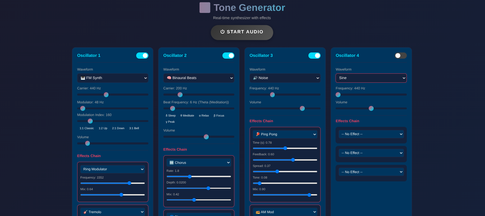

# 🎛️ Tone Generator

A real-time, professional-grade browser-based synthesizer with multiple waveform generators, advanced LFO modulation, and a comprehensive effects engine. Built with the Web Audio API and AudioWorklets for high-performance, zero-latency sound synthesis.

## ✨ Features

### 🚀 Getting Started

1. **Run a local web server** in the project directory (required for AudioWorklets and JS modules):
   - **Using Python:** `python3 -m http.server 8000`
   - **Using Node.js:** `npx serve`
   - **Using VS Code:** Install the **Live Server** extension and click "Go Live"

2. **Open the local address** in your browser (e.g., `http://localhost:8000`)

3. **Click "START AUDIO"** to initialize the audio engine

4. **Enable channels** using the toggle switches

5. **Select generator type:**
   - Traditional oscillators: Sine, Sawtooth, Triangle, Square
   - Advanced: Noise, Binaural Beats, FM Synth, Granular, Infrasound

6. **Adjust settings:**
   - Set frequency/carrier (20Hz - 20kHz)
   - For Infrasound: (0.1Hz - 20Hz)
   - For binaural: set beat frequency (1-50 Hz)
   - For square waves: adjust duty cycle (1% - 99%)
   - Adjust volume and LFO modulation

7. **Add effects:**
   - Select effect from dropdown (up to 3 per channel)
   - Adjust effect parameters in real-time

8. **Use presets** for quick sound exploration

### 🎹 Generator Types (4 Independent Channels)

#### Traditional & Advanced Oscillators
- **Sine** - Pure tone, no harmonics.
- **Sawtooth** - Rich, bright sound with all harmonics.
- **Triangle** - Soft sound with odd harmonics.
- **Square** - Hollow sound with adjustable **Duty Cycle (PWM)**.
- **Noise** - White and Pink noise with adjustable resonant filter.
- **FM Synth** - 2-operator Frequency Modulation for metallic and bell-like tones.
- **Granular** - 🆕 Cloud-based synthesis using AudioWorklets for complex textures.
- **Infrasound** - 🆕 Ultra-low frequency generator (0.1Hz - 20Hz) using AudioWorklets.
- **Binaural Beats** - Brainwave entrainment (best with headphones!).

### 🎛️ Effects Engine (20+ Professional Processors)

#### Dynamics & Character
- **Compressor/Limiter** - Professional dynamics with character/saturation.
- **Zener Limiter** - 🆕 Broadcast-style limiting with pre-emphasis EQ.
- **PreFET Preamp** - Transistor warmth and harmonic saturation.
- **Distortion** - Soft-clipping overdrive with tone control.
- **Bit Crusher** - Lo-fi digital reduction and quantization.
- **Gate/Expander** - 🆕 Noise gate with attack/hold/release controls.

#### Time & Space
- **Pro-R Reverb** - Professional algorithmic reverb with frequency-specific decay.
- **Reverb** - Convolution-based room simulation.
- **Tape Delay** - Analog-style delay with feedback and tone control.
- **Ping Pong** - 🆕 Stereo bouncing delay.
- **Time Stretch** - 🆕 Granular time stretching (change speed without pitch).

#### Modulation & Movement
- **LFO Modulation** - 🆕 Advanced Low Frequency Oscillators (Sine, Square, Triangle, Saw) for modulating any parameter.
- **Chorus / Flanger / Phaser** - Classic modulation effects for thickness and movement.
- **Tremolo / AM Mod** - Amplitude modulation with auto-pan capabilities.
- **Ring Modulator** - Frequency multiplication for robotic/metallic sounds.
- **Pan 360** - 🆕 Full circular surround panner.
- **Doppler** - 🆕 Virtual motion simulation (pitch shift based on distance/speed).

#### Spectral & Utility
- **3-Band EQ** - 🆕 Low, Mid, and High parametric equalizer.
- **Comb Filter** - 🆕 Resonant, metallic textures with high-Q feedback.
- **Wave Folder** - 🆕 West-coast style harmonic folding.
- **Widener** - 🆕 Mid/Side processing for stereo width control.
- **Pitch Shifter** - 🆕 Real-time semitone shifting (-12 to +12).

### 🧠 Binaural Beats - Brainwave Entrainment
Best experienced with headphones! Creates a "beat" frequency that entrains brainwaves:

| Frequency | Name | State |
|-----------|------|-------|
| 1-4 Hz | Delta | Deep sleep, healing |
| 4-8 Hz | Theta | Meditation, deep relaxation |
| 8-14 Hz | Alpha | Relaxed alertness, creativity |
| 14-30 Hz | Beta | Active thinking, focus |
| 30-100 Hz | Gamma | High-level cognition |

## 🏗️ Architecture

- **Factory Pattern**: New generators and effects are automatically registered and UI-ready.
- **AudioWorklets**: Critical processing (Granular, Infrasound) runs in a separate high-priority thread.
- **Modular Routing**: Flexible effect chains per channel.
- **Real-time Visualization**: High-resolution FFT waveform and frequency analysis.

## 📚 Expansion Guide
See **[EXPANSION_GUIDE.md](EXPANSION_GUIDE.md)** for instructions on adding your own oscillators or effects.

## ⚕️ Disclaimer
Binaural beats and Infrasound are for relaxation and experimentation. Do not use while driving. Consult a doctor if you have epilepsy or seizure disorders.

## 📜 License
MIT License - build something cool!

---
**Build, Mod, and Find Your Sound.** 🎵🔊
